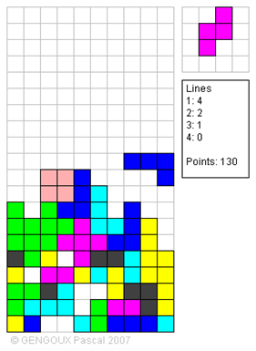

# retro-tetris

## Introduction 

This project was my one of my projects we could choose to do at university. I choose Tetris as I was as a kid a huge fan even though I never owned a GameBoy :)

How does it look like? 

I learned a lot, how game mecanics work. This game uses massively CPU when paused, I didn't got the concept of thread pausing / resuming at that time.
It worked and it was fun to play. 

Look at the highscores.dat where my friends tried to beat my record :P

## Enjoy
